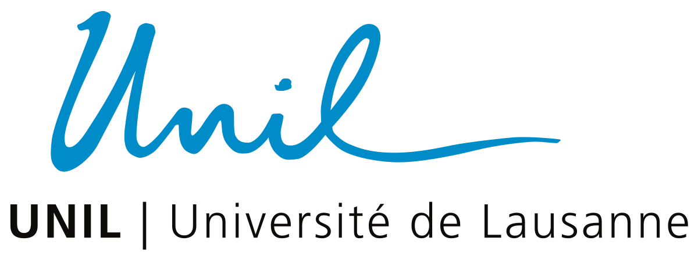

The research project is motivated by the fact that online platforms increasingly play a key role in our societies. This creates **systemic risks to democracy, such as undermining freedom of information and online privacy**. These risks are, however, merely symptoms of a root cause: the high concentration of control and data (CoCoDa) with dominant online platforms.

Both computer science (CS) and legal scholarship (Law) have been developing countermeasures, but typically in disciplinary silos. In CS, researchers have tried to find workarounds for the lack of explicit research platform data access methods by combining available technical methods (e.g., data scraping, blackbox testing, network traffic analysis). However, those approaches face challenges, stemming from platform-imposed restrictions and limited legal support. In Law, the EU enacted the Digital Services Act (DSA) in late 2022 to enable vetted researchers to better access dominant online platforms. However, there is a significant risk that, without sufficient technical support and alignment, these promising legal mechanisms become moot in practice.

To overcome the challenge of having computational methods without (legal) teeth, or legal solutions that are not implementable or miss important technical aspects, there is a **strong need for CS and Law to work closely together** to develop a mutual understanding and integrated implementations of concepts, viewpoints and methods.

## 🚀 Project Aim

The project has two main aims: 1) combine existing technical data access methods with novel legal approaches like the DSA and create new technical methods on this foundation, and to 2) advance current legally mandated platform data access methods and make them work in practice. Your research will be grounded in two use cases in the domains of social media and mobile applications.  By creating integrated "techno-legal" tools, the project supports regulators, researchers, and civil society in studying and mitigating systemic risks arising from data and control concentration in Very Large Online Platforms (VLOPs).

## 📚 Research Questions

### RQ1: Understanding the Status Quo
What are **current legal and technical approaches** to address control and data concentration in dominant platforms, and how can these be **evaluated and compared** with respect to their ability and limitations when measuring and mitigating systemic risk?

### RQ2: Building Better Solutions
What novel ways of **integrating technical and legal means** for accessing data and information about control mechanisms in dominant online platforms can overcome the limitations identified in RQ1, and how effective are these in terms of the evaluation criteria from RQ1?

### RQ3: Scaling and Generalizing
What legal, technical, and techno-legal features are **still required to fortify society against systemic risk from data and control concentration** in UC1 and UC2, and how can the **disconnect between CS and Law**, which commonly work in disciplinary silos, be overcome beyond the project’s UCs?

## 🔧 Use Cases

1. **Freedom of Speech on Social Media**  
   Investigating content moderation and data access limitations in social media (e.g., Instagram, X/Twitter).

2. **Privacy on App Stores**  
   Monitoring privacy practices in mobile ecosystems dominated by Google Play and Apple App Store.

## 👥 Partners in Academia and Civil Society

  
  
  
  

- Prof. Simon Mayer (CS) @ University of St. Gallen 🇨🇭
- Prof. Aurelia Tamò-Larrieux (Law) @ University of Lausanne 🇨🇭
- Dr. Konrad Kollnig (CS) and Prof. Gijs van Dijck (Law) @ Maastricht University 🇳🇱
- Prof. Elena Simperl and Team @ Open Data Institute 🇬🇧

## 📬 Contact

For collaboration or inquiries, please reach out to the project team.

## 📌 Acknowledgements

This project is funded by SNSF (Swiss National Science Foundation) under the International Co-Investigator Scheme, in collaboration with European and UK institutions.
